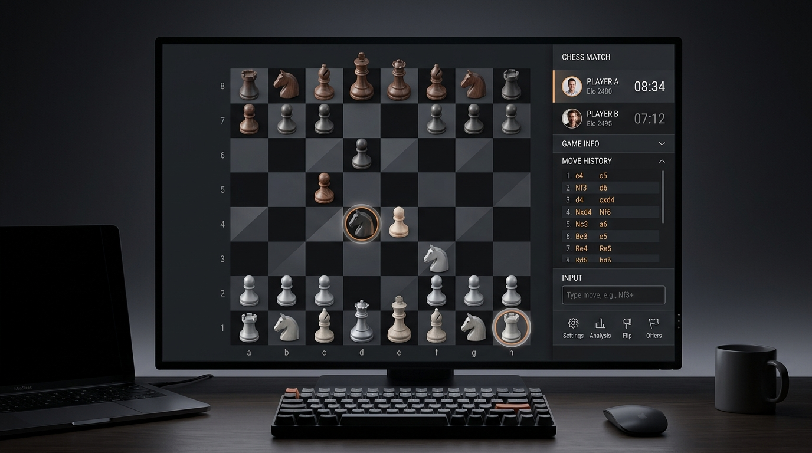

# Grandmaster Text Chess 👑

A sophisticated chess application featuring textual move entry with real-time destination previews, full rule enforcement, and robust peer-to-peer online play.

Play live at: https://srikanthps.github.io/text-chess

  

## Features
- **P2P Multiplayer**: Real-time online pairing and play directly in the browser via PeerJS without any central database dependency.
- **Interactive Move Preview**: Enter algebraic chess notation text commands with interactive previews and valid move guidance.
- **Premium Audio Synth**: Custom synthesized sound effects for landing, captures, and check alerts.

